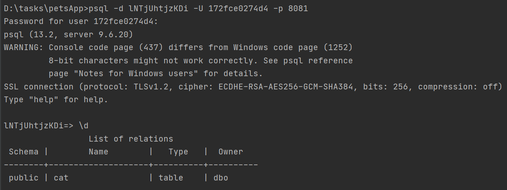
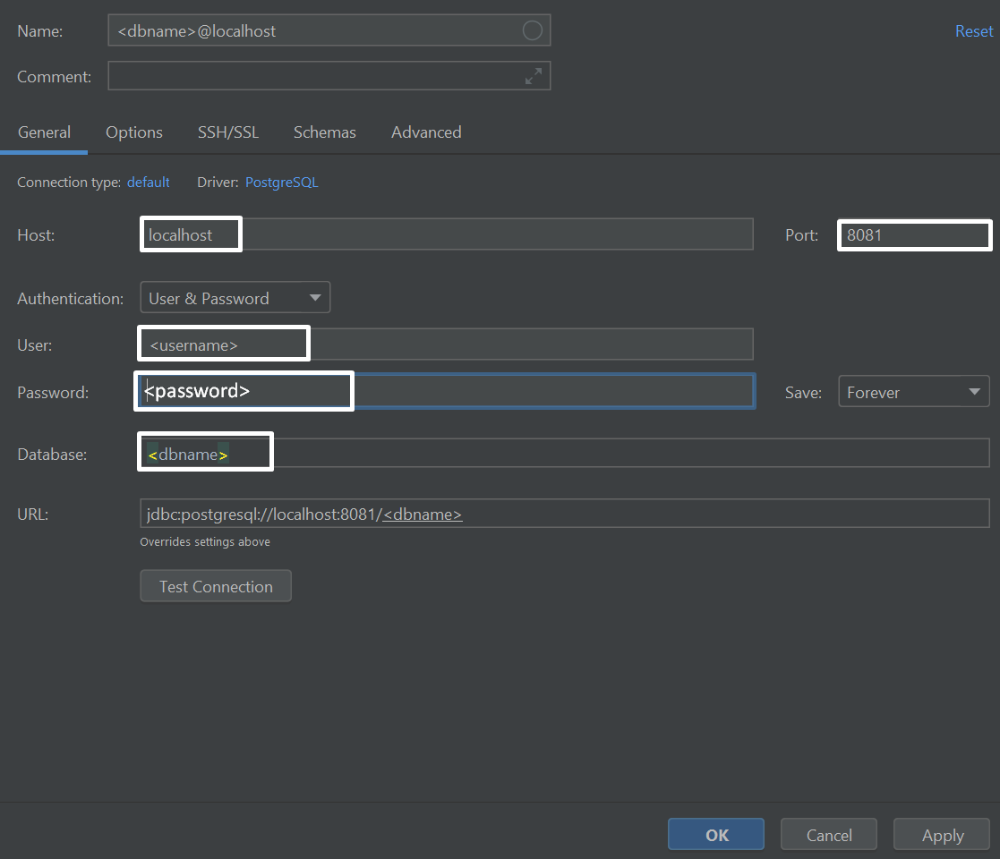

# Pets Application

## Table of Contents

- [Description](#description)
- [Structure](#structure)
- [Usage](#usage)
- [Used technologies](#used-technologies)

## Description

This is simple REST app, running at SAP cloud foundry, which provides user managing instances, such as: User, Pet (Cat,
Dog). You can create/update/delete/get them.

## Structure

Users authentication is provided via Basic authentication. AOP provides logging at service layer. Database provides with
the PostgreSQL service on SAP BTP.

## Usage

1. Create PostgreSQL service on SAP BTP using CLI or using Cockpit. You can create a service instance using the command:
   ```
   $ cf create-service SERVICE-NAME SERVICE-PLAN INSTANCE-NAME
   ```
   For example,
   ```
   $ cf create-service postgresql v9.6-xsmall my_postgres_service
   ```
2. Write config file ([application.properties](src/main/resources/application.properties)).
3. Write manifest ([manifest.yml](manifest.yml)).

3.1 Bind app to service:

- Add to manifest:

   ```
     services:
     - INSTANCE-NAME
   ```

- Or using CLI:

   ```
   $ cf bind-service APP-NAME INSTANCE-NAME
   ```

4. Push app to the cloud:

   ```
   $ cf push
   ```

Finally, your app start working on cloud.

5.This optional step explains how to gain direct access to your DB (service instance).

5.1 Enable SSH for your app.

   ```
$ cf enable-ssh YOUR-HOST-APP
   ```

5.2 Configure an SSH tunnel to your service instance using cf ssh:

   ```
   $ cf ssh -L localhost:8081:<hostname>:<port> YOUR-HOST-APP -N
   ```

- Use any available local port for port forwarding. For example, 8081.
- Replace <hostname> with hostname from your service credentials.
- Replace <port> with port from your service credentials.
- Replace YOUR-HOST-APP with the name of your host app.
- After you enter the command, open another terminal window.

5.3 Connect to the DB:

- Use command line psql to connect to the DB (you need installed postgresql client on your local machine):

   ```
  $ psql -d <dbname> -U <username> -p 8081
  \dt #command to view all tables in the database
   ```



- Also, you can connect using IntelliJ IDEA datasource UI:
  

## Used technologies

- Spring Boot
- JPA
- Spring Security